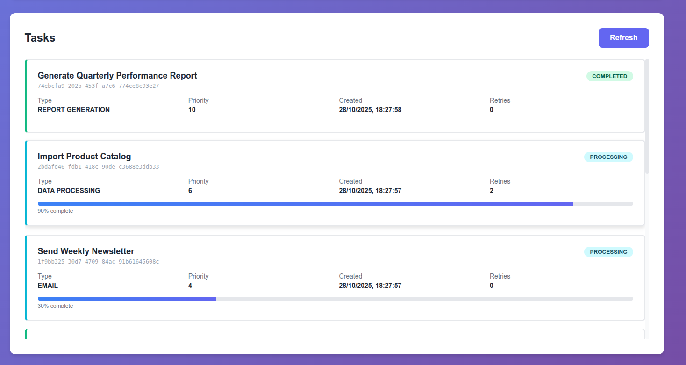

# Real-Time Task Queue with WebSocket Monitoring

A production-ready, scalable task queue system built with FastAPI, Redis, and WebSockets. Features real-time monitoring dashboard, automatic retries, and priority-based task processing.


## Screenshots


*Real-time task queue dashboard with live statistics and progress tracking*


*Individual task progress with real-time updates*

## Features

- **Real-Time Monitoring**: WebSocket-powered dashboard with live task updates
- **Priority Queue**: Tasks are processed based on priority (1-10)
- **Automatic Retries**: Failed tasks are automatically retried with configurable limits
- **Task Types**: Support for multiple task types (Email, Data Processing, File Conversion, API Calls, Report Generation)
- **Scalable Workers**: Multiple worker processes for concurrent task processing
- **RESTful API**: Complete REST API for task management
- **Docker Support**: Easy deployment with Docker Compose
- **Modern UI**: Responsive dashboard built with vanilla JavaScript
- **Task Progress**: Real-time progress tracking for running tasks
- **Error Handling**: Comprehensive error handling and reporting

## Quick Start

### Using Docker (Recommended)

1. Clone the repository
```bash
git clone <your-repo-url>
cd realtime-task-queue
```

2. Start all services with Docker Compose
```bash
docker-compose up --build
```

3. Access the dashboard
   - Open your browser to http://localhost:8000
   - API documentation available at http://localhost:8000/docs

### Manual Installation

#### Prerequisites
- Python 3.11+
- Redis 7+

#### Setup

1. Clone and navigate to the project
```bash
git clone <your-repo-url>
cd realtime-task-queue
```

2. Create and activate virtual environment
```bash
python -m venv venv
source venv/bin/activate  # On Windows: venv\Scripts\activate
```

3. Install dependencies
```bash
pip install -r requirements.txt
```

4. Configure environment variables
```bash
cp .env.example .env
# Edit .env with your configuration
```

5. Start Redis
```bash
redis-server
```

6. Run the FastAPI application
```bash
python main.py
```

7. In a separate terminal, start the workers
```bash
python worker.py
```

8. Access the dashboard
   - Dashboard: http://localhost:8000
   - API Docs: http://localhost:8000/docs

## API Documentation

### Create Task
```bash
POST /api/tasks/
Content-Type: application/json

{
  "name": "Send Welcome Email",
  "task_type": "email",
  "priority": 8,
  "payload": {
    "recipient": "user@example.com",
    "subject": "Welcome!"
  }
}
```

### Get Task by ID
```bash
GET /api/tasks/{task_id}
```

### Get All Tasks
```bash
GET /api/tasks/?limit=100
```

### Get Task Statistics
```bash
GET /api/tasks/stats/overview
```

### WebSocket Connection
```javascript
const ws = new WebSocket('ws://localhost:8000/ws');

ws.onmessage = (event) => {
  const data = JSON.parse(event.data);
  console.log('Received:', data);
};
```

## Architecture

```
┌─────────────┐         ┌─────────────┐         ┌─────────────┐
│   Client    │────────▶│   FastAPI   │◀───────▶│    Redis    │
│  (Browser)  │         │     App     │         │   (Queue)   │
└─────────────┘         └─────────────┘         └─────────────┘
      │                        │                        ▲
      │ WebSocket              │                        │
      │                        │                        │
      ▼                        ▼                        │
┌─────────────┐         ┌─────────────┐                │
│  Dashboard  │         │   Workers   │────────────────┘
│     UI      │         │  (1...N)    │
└─────────────┘         └─────────────┘
```

### Components

- **FastAPI Application**: Handles HTTP requests and WebSocket connections
- **Redis**: Acts as the message broker and task storage
- **Workers**: Process tasks from the queue asynchronously
- **Dashboard**: Real-time monitoring interface

## Configuration

Configuration is done via environment variables or `.env` file:

```env
# Redis Configuration
REDIS_HOST=localhost
REDIS_PORT=6379
REDIS_DB=0
REDIS_PASSWORD=

# Application Settings
APP_HOST=0.0.0.0
APP_PORT=8000
WORKERS=4

# Task Settings
MAX_RETRIES=3
TASK_TIMEOUT=300
```

## Project Structure

```
realtime-task-queue/
├── app/
│   ├── api/
│   │   ├── tasks.py          # Task API endpoints
│   │   └── websocket.py      # WebSocket handler
│   ├── core/
│   │   ├── config.py         # Configuration settings
│   │   ├── redis_client.py   # Redis connection manager
│   │   └── task_queue.py     # Task queue logic
│   ├── models/
│   │   └── task.py           # Pydantic models
│   └── workers/
│       └── task_worker.py    # Worker implementation
├── static/
│   ├── css/
│   │   └── style.css         # Dashboard styles
│   └── js/
│       └── app.js            # Dashboard JavaScript
├── templates/
│   └── index.html            # Dashboard HTML
├── main.py                   # FastAPI application entry point
├── worker.py                 # Worker process entry point
├── requirements.txt          # Python dependencies
├── Dockerfile                # Docker image definition
├── docker-compose.yml        # Docker Compose configuration
└── README.md                 # This file
```

## Task Types

The system supports the following task types:

1. **EMAIL**: Email sending tasks
2. **DATA_PROCESSING**: Data transformation and analysis
3. **FILE_CONVERSION**: File format conversion tasks
4. **API_CALL**: External API integration tasks
5. **REPORT_GENERATION**: Report creation tasks

You can easily extend this by modifying the `TaskType` enum in `app/models/task.py`.

## Task Lifecycle

1. **PENDING**: Task created and waiting in queue
2. **PROCESSING**: Worker picked up the task and is processing it
3. **COMPLETED**: Task finished successfully
4. **FAILED**: Task failed after all retry attempts
5. **RETRYING**: Task failed but will be retried

## Monitoring

The dashboard provides real-time monitoring of:

- Total tasks in the system
- Tasks by status (Pending, Processing, Completed, Failed, Retrying)
- Individual task progress
- Task creation and completion times
- Error messages for failed tasks

## Scaling

### Horizontal Scaling

Scale workers by increasing replicas in docker-compose:

```yaml
worker:
  deploy:
    replicas: 3  # Run 3 worker containers
```

Or run multiple worker processes manually:

```bash
# Terminal 1
python worker.py

# Terminal 2
python worker.py

# Terminal 3
python worker.py
```

### Redis Clustering

For production, consider using Redis Cluster or Redis Sentinel for high availability.

## Testing

Test the system by creating tasks via the dashboard or API:

```bash
# Create a test task
curl -X POST http://localhost:8000/api/tasks/ \
  -H "Content-Type: application/json" \
  -d '{
    "name": "Test Task",
    "task_type": "data_processing",
    "priority": 5,
    "payload": {"records": 1000}
  }'
```

## Development

### Adding New Task Types

1. Add the task type to `TaskType` enum in `app/models/task.py`
2. Implement task logic in `app/workers/task_worker.py`
3. Update the dashboard form in `templates/index.html`

### Customizing Task Processing

Modify the `execute_task` method in `app/workers/task_worker.py` to implement your custom logic.

## Security Considerations

For production deployment:

1. **Enable Redis authentication**: Set `REDIS_PASSWORD` in environment variables
2. **Use HTTPS**: Deploy behind a reverse proxy (Nginx/Traefik) with SSL
3. **Add authentication**: Implement JWT or OAuth for API endpoints
4. **Rate limiting**: Add rate limiting to prevent abuse
5. **Input validation**: Already implemented via Pydantic models

## License

MIT License - feel free to use this project for your portfolio or production applications.

## Contributing

Contributions are welcome! This project demonstrates:

- FastAPI best practices
- Async Python programming
- WebSocket implementation
- Redis queue patterns
- Docker containerization
- Modern frontend development

## Technical Details

This project demonstrates proficiency in:

- **Backend Development**: FastAPI, async/await patterns, RESTful API design
- **Message Queues**: Redis-based task queue implementation
- **Real-Time Communication**: WebSocket connections for live updates
- **System Design**: Scalable microservices architecture
- **DevOps**: Docker, docker-compose, containerization
- **Frontend**: Vanilla JavaScript, WebSocket client, responsive design
- **Error Handling**: Retry logic, error reporting, graceful degradation
